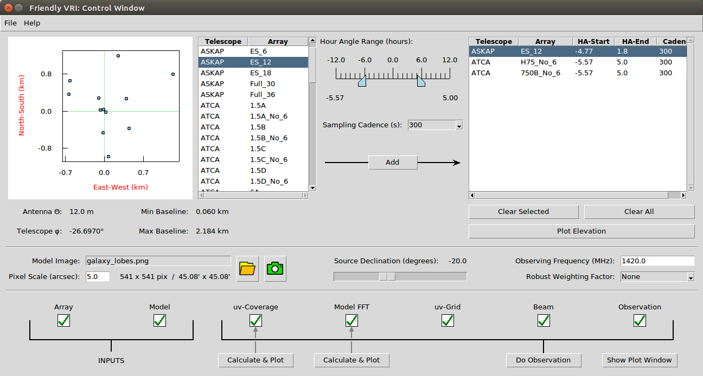
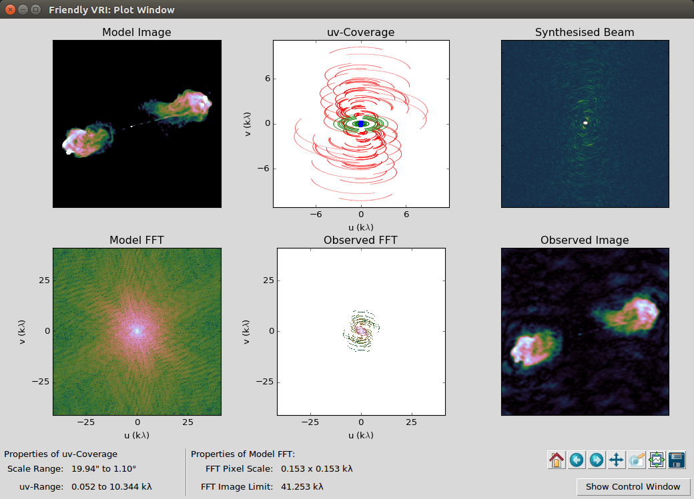

# The Friendly Virtual Radio Interferometer
The Friendly Virtual Radio Interferometer (VRI) is designed to
simulate astronomical observations using linked arrays of radio
antennas in a technique called *earth rotation aperture synthesis*. As
the successor to the original [Java-based
VRI](http://adass.org/adass/proceedings/adass97/mckayn.html), it
focuses on simulating the effect of combining different antenna
layouts.





## Installation:

The Friendly VRI is written in Python to work with both Python 2.7.x
and 3.x. You will need the following modules installed:

* numpy
* matplotlib
* pil *or* pillow
* tkinter
* opencv (optional - enables web-cam image capture)

If you use the default python interpreter these can usually be
installed from the command line on Linux or Mac OS X by executing the
command ```sudo pip install <module_name>```. If you are running Anaconda
scientific python the command is ```conda install <module_name>```.

Once all required modules are installed, click on the 'View on GitHub'
link at the top of the page and then the 'Clone or download' button.

##### A note about opencv on Mac OS X:

The default installation of opencv on Anaconda for Mac OS X seems to
be broken (causes a segmentation fault). Some folk on the internet
have reported success installing a working opencv module using the
command ```conda install -c https://conda.binstar.org/menpo
opencv```. If this works for you and you want to enable the web-cam
capture button for Mac OS X, comment out the following lines in the
'vriTk.py' code:

```python
if sys.platform=="darwin":
    hasCV2 = False
```


## Usage

Start the application by executing ```python vriTk.py``` on the
command line from within the ```friendlyVRI/``` directory. The
interface is (hopefully) very intuitive and is split into a control
window and a plotting window. The plotting window can be maximised and
buttons at the lower-right enable jumping quickly between the two
windows. The control window allows you to:

* Plot the layout of the antennas in an array configuration for a
particular telescope.
* Create a list of observations to be simulated using different array
configurations, over different time ranges (hour angle) and with
different sampling cadence.
* Load in a model image and set its angular scale on the sky.
* Apply the uv-coverage of the observations to the model to simulate an
observation.

The plotting window shows inputs, outputs an intermediate steps in the
process: model image, fast Fourier transform (FFT) of the model, plot
of uv-coverage, filtered model FFT, synthesised beam and final
observed image.

See the file 'HELP.txt' or the help menu for step-by-step instructions.

## Caveats

This software is designed to be a simple 'quick-look' tool and ignores
lots of effects such as non-co-planar arrays, time averaging,
multi-frequency synthesis etc. It also sets the sampling grid in the
Fourier domain from the extent and pixel spacing of the input image,
which can result in under-sampled synthesised beams and artefacts. At the
moment, the observing simulations are assumed to be noise-free and no
attempt is made at calculating sensitivities. Tasks to perform robust
simulations of an interfometric observation exist in CASA, MIRIAD and
AIPS, but are more difficult to use.

## Other VRI Software

Other excellent virtual interfeometer software has been developed by
staff at observatories around the world:

* [APSYNSIM](https://launchpad.net/apsynsim) is a 'full-fat' simulator
  by Ivan Marti-Vidal at Onsala Space Observatory, Sweden. 
* [Pynterferometer](http://www.jb.man.ac.uk/pynterferometer/index.html)
  is a public demonstration tool by Adam Avison and Sam George and has
  excellent documentation in the accompanying
  [paper](https://arxiv.org/abs/1211.0228).


## Credits and Contact Information:

The Friendly Virtual Radio Interferometer tool was written by **Cormac
Purcell** and **Roy Truelove** at Macquarie University,
Sydney. Questions, comments, feature requests and bug reports should be
directed to 'cormac.purcell (at) mq.edu.au'.
